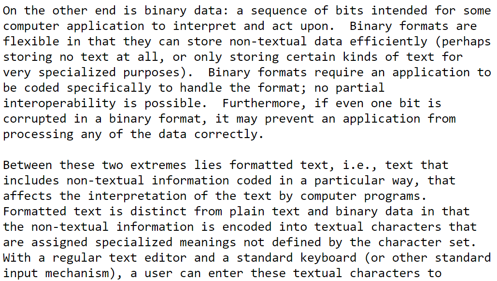
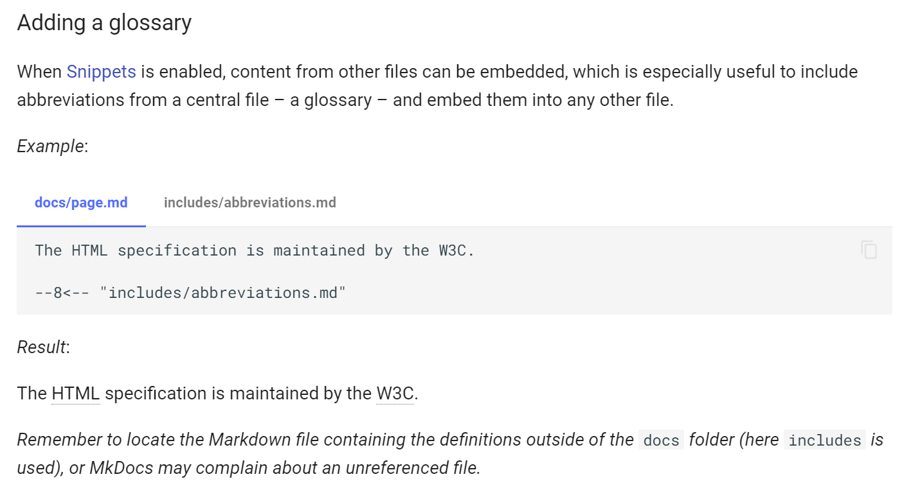
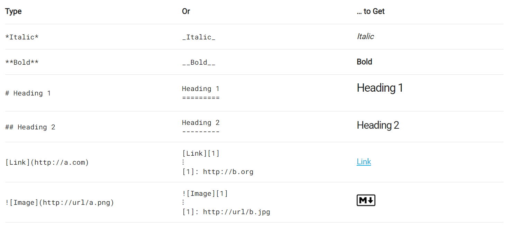
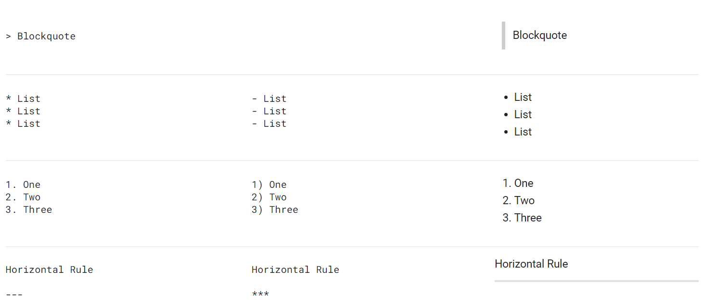
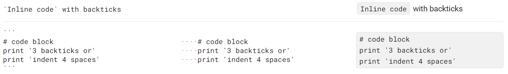

# Markdown

*Вселенная из кучки символов*

------

## Контекст задачи

*В чём вообще проблема?* :thinking:

---

* Вокруг нас много *текста*
* *Текст* важно **оформлять**
* **Оформлять** – долго и сложно…

---



---


### <!-- fit --> :scream:

---

*Но есть и позитивные [примеры](https://squidfunk.github.io/mkdocs-material/reference/abbreviations/)…*

---



---

#### Чтобы ваш текст читали, в нём должы быть:

* **Блоки**: разделы, абзацы, пустые строки…
* **Пункты**: списки, последовательности
* **Акценты** (выделения текста)
* **Якори**: заметные ссылки, заголовки, значки

<!-- _footer: ":point_up: Только если текст достаточно большой" -->

---

<!-- Можно упомянуть Notepad++ -->

#### Да запросто!

**:joystick: Универсальные решения** 

- Word/Google Docs
- OneNote
- HTML (WYSIWYG)

:wrench: **Решения под задачу***

- Outlook
- Confluence/JIRA
- ServiceDesk

<!-- _footer: "* На самом деле сводятся к HTML" -->

---

Решений много, но нет ни одного, которое бы обладало **одновременно 3 качествами**:
&nbsp;  

1. Простой синтаксис (или удобный UI к нему)
2. Независимость от инструмента
3. Широкая поддержка в экосистеме

---

*и тут такой появляется*

### <!-- fit --> Markdown


---

По [задумке](https://daringfireball.net/projects/markdown/) автора:

> Markdown is a text-to-HTML conversion tool…  
> allows you to write using an **easy-to-read**,   
> **easy-to-write** plain text format, then convert it to structurally valid XHTML (or HTML).

---

<!-- _color: white -->

<!-- _backgroundColor: black -->


> … the single biggest source of inspiration for Markdown’s syntax is the format of **plain text email**.

<!-- _footer: "https://daringfireball.net/projects/markdown/" -->

---

Какой была переписка раньше

```text
> Предлагаю заключить договор с этим партнёром

Отличная идея:) Но очень *важно* успеть этой _осенью_, потому что:
- иначе нас могут опередить конкуренты
- в конце года партнёр будет занят отчётностью
- не хочется рисковать праздниками
```

---

**Такой формат:**

* Интуитивно понятен
* Легко применять
* Не требует специальных инструментов
* Пригоден для машинного парсинга и генерации

---



<!-- _footer: "https://commonmark.org/help/" -->

---



<!-- _footer: "https://commonmark.org/help/" -->

---



<!-- _footer: "https://commonmark.org/help/" -->

---

Но это лишь синтаксис.

А где **спецификация**? :thinking:

---

Изначально Markdown – [скрипт](https://github.com/mackyle/markdown/blob/master/Markdown.pl) на Perl

```perl
# ...
$addr =~ s{(.)}{
	my $char = $1;
	if ( $char eq '@' ) {
	    # this *must* be encoded. I insist.
	    $char = $encode[int rand 1]->($char);
	} elsif ( $char ne ':' ) {
# ...	
```

<!-- _footer: "3700+ LoC :scream:" -->

---

Так было в 2004-ом. 

К 2020-ому стало лучше.

---


* Есть спецификация https://commonmark.org/
  
* Есть реализации под кучу языков и платформ
  
* Есть даже [книга](https://www.markdownguide.org/book/) :point_right:

---

*Но путь был тернистым…*

---

* 10 лет каждый пилил парсеры под себя
* Спефикация уточнялась на ходу
* Единой экосистемы не было (и нет)

---

Наверно, он бы уже сдох

---

Если бы не

* Открытость формата
* Простота парсинга 
* Встроенный “fallback” к тексту
* Совместимость с HTML

---

Эти качества обеспечили формату широчайшие…

---

<!-- _color: white -->

<!-- _backgroundColor: black -->


### <!-- fit --> Применения Markdown

---

#### Source Code Platforms

* [Bitbucket](https://confluence.atlassian.com/bitbucketserver070/markdown-syntax-guide-996644374.html?utm_campaign=in-app-help&utm_medium=in-app-help&utm_source=stash)
* [GitHub Flavored Markdown](https://github.github.com/gfm/)
* [GitLab](https://docs.gitlab.com/ee/user/markdown.html)

---

#### Instant Messaging

- [WhatsApp](https://faq.whatsapp.com/general/chats/how-to-format-your-messages/?lang=ru)

---


---

#### Instant Messaging

- [WhatsApp](https://faq.whatsapp.com/general/chats/how-to-format-your-messages/?lang=ru)
- [Telegram](https://core.telegram.org/bots/api#markdown-style)

---

#### Instant Messaging

- [WhatsApp](https://faq.whatsapp.com/general/chats/how-to-format-your-messages/?lang=ru)
- [Telegram](https://core.telegram.org/bots/api#markdown-style)
- [MS Teams](https://support.microsoft.com/ru-ru/office/%D0%B8%D1%81%D0%BF%D0%BE%D0%BB%D1%8C%D0%B7%D0%BE%D0%B2%D0%B0%D0%BD%D0%B8%D0%B5-%D1%84%D0%BE%D1%80%D0%BC%D0%B0%D1%82%D0%B8%D1%80%D0%BE%D0%B2%D0%B0%D0%BD%D0%B8%D1%8F-markdown-%D0%B2-teams-4d10bd65-55e2-4b2d-a1f3-2bebdcd2c772)

---

#### Text Processing

* [IntelliJ IDEA](https://www.jetbrains.com/help/idea/markdown.html#code-blocks)
  Также есть [платный плагин](https://plugins.jetbrains.com/plugin/7896-markdown-navigator-enhanced)
* [Atom](https://atom.io/packages/markdown-preview)
* [Typora](https://typora.io/) :heart_eyes:

---

#### Knowledge Management

* [Confluence Wiki Markup](https://confluence.atlassian.com/doc/confluence-wiki-markup-251003035.html)
  Есть отдельный [плагин](https://marketplace.atlassian.com/apps/1211445/markdown-for-confluence?hosting=cloud&tab=overview)
* [Material for MkDocs](https://squidfunk.github.io/mkdocs-material/)
* [OpenContainers Image Spec](https://github.com/opencontainers/image-spec#markdown-style)

---

#### Static Site Generation

* [Jekyll](https://jekyllrb.com/)

* [Hugo](https://gohugo.io/)

  *:information_source: [Пример](https://toparvion.pro/post/2020/integraph/) статьи с [исходником](https://github.com/Toparvion/toparvion.pro/blob/master/content/ru/post/2020/integraph/index.md)*

---

#### Presentations & Slides

* [Marp](https://marp.app/)
  А эти слайды [откуда](https://github.com/Toparvion/markdown-intro/blob/master/markdown.md)? :wink:
* [RevealJS](https://revealjs.com/)
* [GitPitch](https://gitpitch.com/)

---

Знаешь свой уникальный пример? 

Расскажи! :slightly_smiling_face:

---

# Вместо заключения

---

* Помни о преимуществах текста :point_up:
* Стремись к унификации формата :crystal_ball:
* Если есть выбор, выбирай **Markdown** :cocktail:

---

### Спасибо за внимание! :hugs:

##### *Вопросы?*